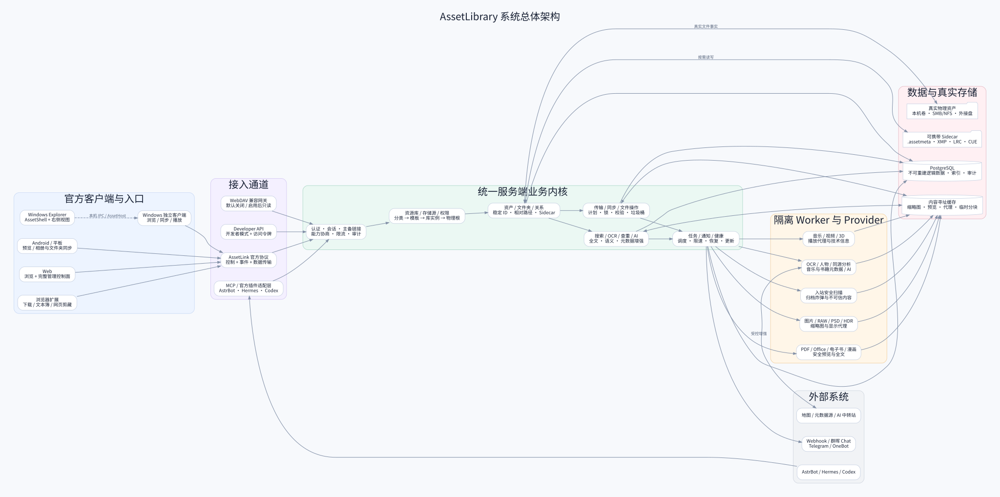

# 05. 总体架构与技术框架



## 5.1 架构目标

- 同一业务内核服务 Windows、Linux、Docker 三种服务端发行；
- 官方客户端拥有完整、独立、可协商的 AssetLink 协议；
- 所有文件写操作汇入统一计划、锁、校验和审计；
- Provider 与 Explorer 隔离；
- PostgreSQL 承担领域状态、索引、任务与审计；
- 真实资产始终保留在用户物理目录中；
- 50 万资产下仍可分页、增量和可恢复运行。

## 5.2 冻结技术基线

### 服务端

推荐采用跨平台服务端框架构建单一核心宿主，目标形态：

- HTTP/2/HTTPS API 与事件通道；
- Windows Service、systemd 和容器三种宿主包装；
- PostgreSQL 原生迁移；
- durable task / outbox / lease / heartbeat；
- 独立 Worker Supervisor；
- 内容寻址文件缓存。

M0-009 冻结服务端为 C# 14、.NET 10 LTS、ASP.NET Core 10，同一核心服务 Windows、Linux 和 Docker。V01-001 已由 `global.json` 固定 SDK 10.0.111，并激活锁定 restore、build、test、漏洞和许可证门禁。V01-015 至 V01-020 按 ADR-0014 组合了显式 HTTPS 只读试用：持久认证、分模块 PostgreSQL 连接与必需就绪检查、首次扫描和浏览 API；文件探测/扫描在隔离子进程内执行。V01-021 至 V01-023 按 ADR-0015 将同一 Host/Web 部署到真实 NAS Docker，Core 与 PostgreSQL 分容器，资产只读挂载，私密状态持久化；健康探针、隔离 Worker 和 POSIX 路径保护在物理适配边界实现。M0-004-G2 已依据真实生命周期及回收证据关闭；默认健康宿主兼容，Windows Service、Linux systemd、容量、生产写入和完整 Alpha 仍受各自门禁约束。

### Web

冻结 Node.js 24 LTS 构建、TypeScript 6.0.x 和 React 19.2.x 技术族。`apps/web` 固定补丁和锁文件，提供虚拟列表、可取消请求、响应式浏览和搜索；V01-018/020 已接入真实同源登录、管理员登记目录、首次扫描进度/取消/失败重试及跨标签会话失效。格式化、lint、类型、构建、浏览器、漏洞与许可证门禁均已激活。V01-024..026按ADR0016补齐首页、分类/库管理、History导航、条目详情、多选与响应式布局；分类、排序/筛选/锚点定位和搜索范围由核心授权查询支撑，迁移增至21。内容预览、增量索引及其他完整管理能力仍待实现。状态管理和组件库按真实用例选择，不预建第二框架。

### Windows 独立客户端

冻结 C# 14、.NET 10、WinUI 3 / Windows App SDK 2.x stable 技术族。首个生产清单固定精确 stable patch，且不并存第二套桌面 UI 框架。客户端必须支持多窗口、系统媒体控制、高 DPI、浅深色、URI 激活、本机凭证和后台 AssetHost。

2026-09-08 用户明确 Windows 首版的使用入口必须嵌入原生 Explorer，不能要求另开独立应用。
ADR-0018 因此以系统 DefView/IShellFolder2 与进程外 .NET AssetHost 为当前首版方向；
WinUI 专业视图仍是后续稳定复用目标，不将 WinUI/.NET 加载到 Explorer 进程。
V03-002/V03-006 已完成只读协议组件及 test-only Shell 原生进入/注销验证；当前按冻结的只读快照 IPC 接入进程外 AssetHost 与真实 Core，
没有可用的 Windows 安装包，M0-002-G1..G4 保持开放。

### Windows Shell

冻结为 C++17、Windows SDK 10.0.26100、COM/C++/WinRT 的最小桥接。重型视图、网络与解析必须在进程外 Host。M0-002 只完成了部分 Windows 证据；`explorer-v0.5` 的四个门禁关闭前不得创建或启用生产 Shell 实现。

### Android

冻结 Kotlin 2.3.x、Jetpack Compose stable BOM 和 AGP 9.x 技术族，精确版本由首个 Gradle 清单和 dependency verification 固定。这是预算级选择，首个实现任务必须先建立真实 Android 门禁。使用 MediaStore、Storage Access Framework、WorkManager/前台传输、系统 Sharesheet 和响应式窗口布局；小米增强通过独立 Provider/适配层，不污染标准 Android 主线。

V03-003 已建立原生只读应用与 Android 平台门禁，精确 AGP/Kotlin/Compose/SDK 及锁见
`apps/android/README.md` 和清单。同一 APK 提供手机/平板浏览、查询与文件信息，直接消费
生成 Kotlin SDK 及既有授权 API。内容预览、同步、MediaStore/SAF 写流程和完整 V0.3 尚未交付。

### 数据与搜索

- PostgreSQL 16.x：领域数据、权限、索引、任务、审计；
- PostgreSQL FTS / trigram：基础全文和模糊搜索；
- 向量扩展可选：AI 语义层，不作为核心依赖；
- 文件缓存：按内容哈希 + Provider版本 + 规格命名；
- 不引入 Redis、第二数据库、独立搜索或消息集群作为 V0.1 地基；只有真实生产型指标持续超预算且有批准 ADR、迁移与退出方案时才能改变。

## 5.3 服务端模块

```text
Gateway / Auth
Library & Storage
Asset & Folder Identity
Metadata & Sidecar
Scan & Reconciliation
Transfer & Sync
Operation Plan & Trash
Search & Dedup
Preview & Provider Supervisor
Task / Notification / Health
Backup / Update / Diagnostics
```

模块可独立部署为进程或 Worker，但首期不应把个人 NAS 系统拆成过度微服务。建议“模块化单体核心 + 隔离 Worker”，通过清晰契约保证后续拆分能力。

## 5.4 数据一致性

- PostgreSQL 记录系统状态，文件系统记录物理事实；
- 操作采用 intent/plan → execute → verify → commit 状态机；
- 外部 SMB 变化由观察与重指向修正索引；
- 数据库不能因记录存在而擅自恢复或改动文件；
- 文件操作崩溃后必须通过源、临时、目标和哈希判断真实状态。

## 5.5 Provider 隔离

Provider 只提供识别、元数据、缩略图、预览、分析、Sidecar候选和操作建议。默认只读、无网络、有限资源。原文件修改必须回到核心操作计划。

官方/签名 Provider 为主，高级用户可侧载；不建设公共插件市场。第三方和重型代码不得加载进 `explorer.exe`。

## 5.6 三种服务端发行的共享边界

同一核心输出：

```text
Windows x64 服务端
Linux x86-64 服务端
Docker / Compose 服务端
```

差异只存在于：安装、服务管理、路径、权限适配、更新和可用 Provider。数据库 Schema、AssetLink、备份、Web UI 和业务语义必须一致。

## 5.7 模块内部结构与依赖方向

服务端模块按 `Domain / Application / Infrastructure / Contracts`（或经 ADR 批准的等价结构）组织。依赖只能从入口和适配层流向 Application、再流向 Domain；Infrastructure 实现核心定义的端口。模块间只通过公开命令、查询、端口、契约、领域事件或批准的只读投影交互，禁止跨模块写表和直接引用内部实现。

Web、Windows、Android、Explorer、WebDAV、Developer API 与 MCP 必须复用同一业务用例。跨端共享协议、生成 SDK、错误码与设计语义，但不强行共享平台原生 UI。完整规则见 `docs/22_编码与架构开发原则.md`。

模块、数据、迁移与共享契约的唯一 owner，技术版本证据级别以及开放 release gate，统一以 `docs/23_M0架构冻结与质量门禁.md` 为准。
