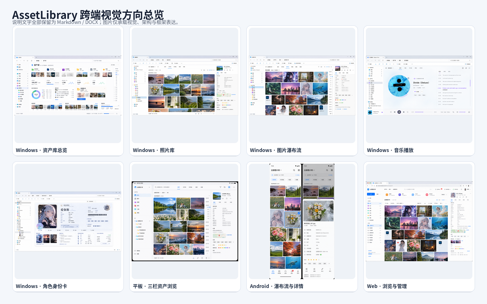

# 12. UI、交互与视觉规范



## 12.1 Windows Explorer 边界

顶部标签、地址栏、搜索、命令栏和左侧导航保持 Windows 原生。所有自定义专业界面、详情、播放器和角色页只在右侧区域内。音乐底部播放栏不得跨入左栏。

## 12.2 统一三层页面

```text
资源库首页
→ 真实文件夹视图
→ 单资产详情 / 专业预览
```

每种专业库可有不同页签，但操作位置和状态语言一致。

## 12.3 基础操作

- 单击：选中并刷新详情；
- Ctrl/Shift：多选；
- Space：Quick Look，不改变导航历史；
- 双击：按格式进入内置预览或专业软件；
- Ctrl+Enter：专业软件打开真实原文件；
- F2：真实改名；
- Delete：进入统一垃圾桶；
- Ctrl+C/X/V：真实复制、剪切、粘贴。

## 12.4 详情面板

宽屏常驻右侧，窄窗口折叠为抽屉或底部面板。照片时间轴、地图和详情不能同时挤压主内容到不可用。

## 12.5 聚合与物理视图

聚合页、收藏夹、保存视图、人物和时间轴必须显示“逻辑/聚合视图”身份。物理目录卡片显示文件夹图标和真实相对路径。

## 12.6 首页

分为资产库总根、分类聚合页和具体资源库首页。Explorer强调常用与待处理；Web强调管理；Android强调同步、最近和收藏。首页数据来自后台增量摘要，不临时全库计算。

## 12.7 角色页面

总览完整显示角色身份卡；进入人设、相册、日记等详情后收缩为紧凑角色头部。一级页签进入导航历史，页内筛选和月份留在页面状态。

## 12.8 移动端

手机：顶部切库、瀑布流、底部导航、详情底部抽屉。平板：左侧导航、中央内容、右侧详情。视觉语言一致但不机械复制桌面布局。

## 12.9 性能体验

- 先显示骨架和缓存结果；
- 列表/瀑布流虚拟化；
- 快速滚动只取小缩略图；
- 输入变化取消旧搜索；
- 网络和 Provider 超时可取消；
- Explorer 不白屏等待全局统计。
