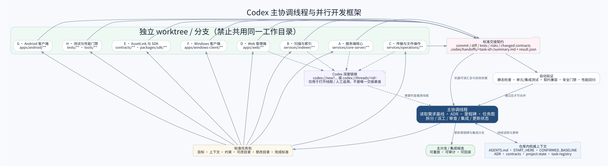

# 17. Codex 并行开发工作流



## 17.1 主协调线程

负责读取需求、架构、里程碑、任务图和项目状态；拆分、派工、裁决共享契约、评审、集成、测试和更新状态。它不应亲自实现所有模块。

## 17.2 子代理与独立线程

- 短期分析、测试、审查：优先 Codex subagent；
- 长期模块开发：独立 Codex 线程 + 独立 Git worktree；
- 任何并行写任务禁止共用同一工作目录。

## 17.3 任务包

每个任务必须写明：

- 目标和完成标准；
- 必读上下文；
- 允许/禁止修改目录；
- 依赖与共享契约；
- 安全、权限和性能约束；
- 必须执行的测试。

## 17.4 标准交接

每个任务必须产出：

```text
.codex/handoffs/<task-id>/summary.md
.codex/handoffs/<task-id>/result.json
.codex/handoffs/<task-id>/tests.md
```

同时提供分支、commit、diff、测试、风险、遗留、共享契约变化和建议合并顺序。

## 17.5 深度链接

`codex://new?path=...&prompt=...` 用于创建工作区线程，`codex://threads/<id>` 用于打开已有线程。深度链接只作为导航和人工追溯；主线程不能依赖打开UI才能获取结果。

## 17.6 worktree 生命周期

```text
主线程登记任务
→ scripts/codex-new-task.py 创建分支与独立 worktree
→ 任务包和 handoff 骨架写入该任务 worktree
→ 协调仓库更新 task-registry
→ 工作线程实现、测试并提交标准交接 + commit
→ 主线程从 worktree/commit/交接文件评审与运行 CI
→ 按顺序合并
→ 更新状态
→ 清理或保留 worktree
```

脚本默认基于 `main` 创建 worktree；初始化后必须先提交一份可引用的基线。任务分支中的任务包与交接文件随该分支一起提交，避免多个并行任务在主工作目录中争用同一组交接文件。

## 17.7 首轮并行建议

- 服务端核心；
- 扫描与索引；
- 传输与文件操作；
- Web；
- AssetLink与SDK；
- Windows独立客户端；
- Android；
- 测试与性能。

但共享契约未稳定前只做Spike与骨架，不允许八个线程分别发明自己的数据模型。

## 17.8 架构一致性与 M0-009

每个任务包必须声明所属模块、依赖方向、复用点、数据所有者、是否新增语言/框架/重大依赖，以及需要执行的架构测试。标准交接中的 `result.json` 必须填写 `architecture_review`。

M0-009 是 M0 收敛任务：读取 M0-001 至 M0-008 的 Spike 结果，冻结实际技术栈、模块引用规则、生成 SDK、数据库迁移所有权和语言特定的 CI 门禁。M0-009 未通过前，主协调线程不得批准 V0.1 大规模功能实现。
